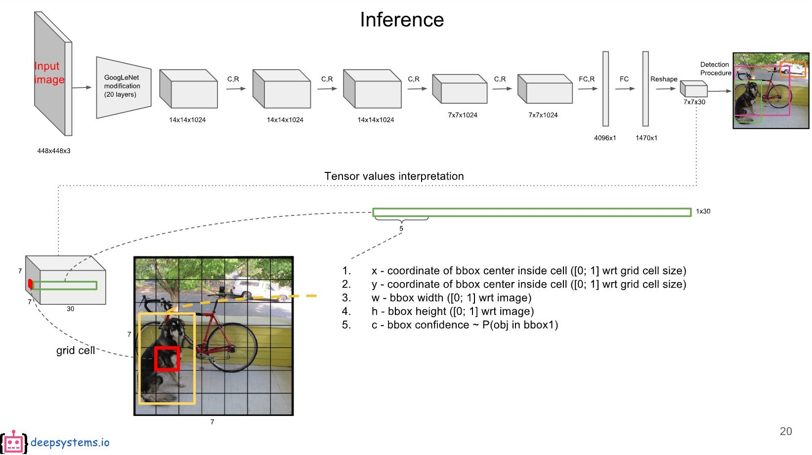
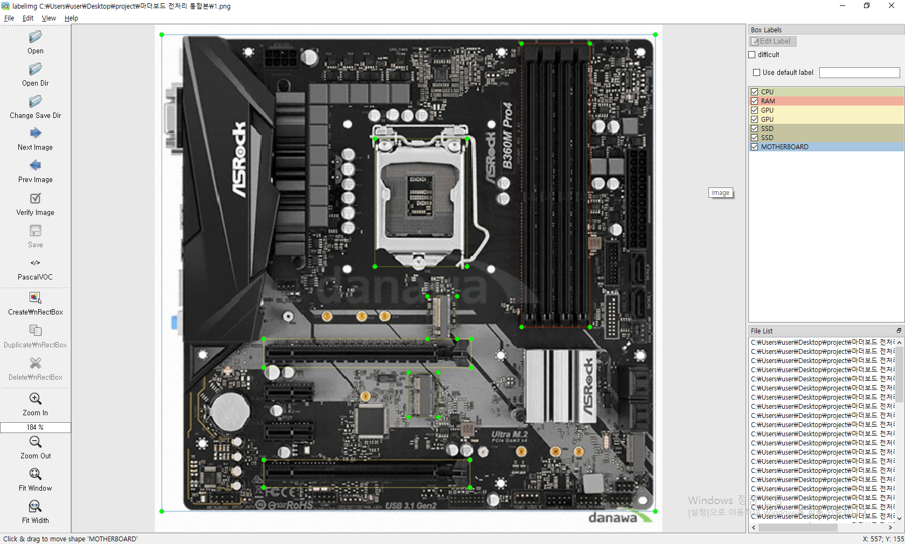

# yolo v3 details

1. **이론**
   1. YOLO(You Only Look Once)
   2. 모델 설명
   3. 훈련(Loss Function)
   4. 추론(객체 검출)
2. **실습**
   1. 설치
   2. 사용자정의 훈련
   3. 추론(객체 검출)
3. 활용(안드로이드 opencv)
4. 한계


## 1. 이론

### 1.1. Yolo(You only look once)

  

Yolo는 CV(Computer vision)에서 object detection(이미지에 사각박스를 만드는 작업)분야에 해당되는 기술입니다.

특징은 R-CNN(regional-CNN), Fast R-CNN, Faster R-CNN 등과 비교했을 때, 처리속도가 빨라서 실시간 detection이 가능하다는 것입니다. R-CNN(20초/하나의 image), Fast R-CNN(2초/하나의 image), YOLO v1(28ms/하나의 image)

또 다른 특징은 사용하기가 다른 모델들에 비해서 간편하기 때문에(리눅스 기준 make만 해주면, 사용 가능) Object Detection 분야에서 인기가 있는 편입니다.

  

(이미지 출처:  https://github.com/hoya012/deep_learning_object_detection )


 ### 1.2. 모델 설명

먼저 이미지(훈련이미지)를 448x448x3(가로 세로 448, RGB 색상채널이라서 3개가 있음)로 조정해준 다음, 컨볼루셔널 레이어를 통해서 학습하고, 검출하게 됩니다.

자세한 사항은 아래의 그림의 `원 출처`로 들어가서 슬라이드를 보는 것을 권장드립니다.

  

(이미지 출처:  https://curt-park.github.io/2017-03-26/yolo/, 원 출처: https://goo.gl/g9kYQT )

- 모델은 googlenet의 변형 모델을 사용했고, 좀 더 정확하게 사용하기 위해서 추가적인 CNN을 뒀습니다. 마지막에는 fully connected Layer를 2개 뒀습니다. 결과 값으로는 위 그림에서는 7x7x30 결과물의 텐서 차원이 되고 바운딩 박스를 만들어내게 됩니다.(S x S x (B*5 + the number of classes))

- 백 프로퍼게이션은 SGD 알고리즘을 사용했습니다.
- 이전의 알고리즘들(R-CNN, Fast R-CNN)은 물체가 있을 것 같은 영역을 알고리즘으로 탐색한 후, CNN으로 클래스들 마다 하나하나 일치하는지 아닌지를 비교했기 때문에 느렸습니다. 하지만, yolo는 한 번에 바운딩 박스의 위치와 크기, 클래스의 종류를 추론합니다.

## 1.3. 훈련(loss function)

## . 실습(on Azure)

### 2.1. 설치

#### 2.1.1. spec

[H/W]
cloud: MS Azure
os: ubuntu 18.04
gpu: tesla M60 / 6개

[S/W] (will be installed)
CUDA: 10.1
cuDNn: 7.6.4
opencv: 3.4.0


#### 2.1.2. Azure 설정

언어가 영어로 되어 있더라도 상관은 없으며, 필요하시면 오른쪽 상단에 변경하시는 버튼이 있습니다.

리소스 그룹을 먼저 생성한 후, 리소스 만들기 > Ubuntu Server 18.04 LTS 선택


만약 ubuntu가 없으면, marketplace 검색에서 검색하시면 됩니다.

- 저는 리소스 그룹을 RG-yolo로 만들었기 때문에, RG-yolo를 선택합니다.
- 가상 머신 이름 VM-yolo
- 지역은 미국 동부로 하시는 것이 좋습니다. (각 지역별로 제공되는 서비스와 하드웨어가 상이하기 때문입니다.)
- 크기 변경 > 모든 필터들 해제해서 > GPU가 있는 머신으로 선택합니다. (저는 NV6_Promo를 선택했지만, 추후에 변경될 수도 있을 듯 합니다. 크기 -> 크기변경 -> 모든 필터들 해제해주셔야 나옵니다.)


네트워킹에서는 부트진단만 꺼줍니다.(실제 서비스할 용도가 아니면, 부트진단을 안해도 괜찮기 때문입니다.)


검토 + 만들기를 해줍니다.

저는 시간당 760원정도 과금되는 것을 확인했습니다.

모든 리소스 -> VM-yolo -> 연결

위의 차례대로 들어와서 아래의 화면처럼 복사 아이콘이 있는 것을 클릭하면 복사됩니다,


저는 xshell이라는 터미널을 사용해서 원격으로 접속하겠습니다.


이제부터는 아래의 명령어를 그대로 입력하면서, 주석들 확인해 주시면 되겠습니다.


#### 2.1.3. opencv 설치

yolo에서 학습과 객체 검출을 할 때, opencv 가속을 지원받기 위해서 설치합니다.

3.4.0 기준으로 설치하겠습니다. (3.4.2 버젼도 설치했을 때 이상 없었습니다.)

(속도가 느려도 괜찮다면, 설치하지 않으셔도 됩니다.)

(1) 설치

사전 도구들 설치(참고 사이트: https://j-remind.tistory.com/57?category=693866)

```bash
# $는 입력하지 마시고, 한줄씩 입력하면서 확인 후 엔터를 눌러주세요

# 프로그램들 업데이트 및 업그레이드
$ sudo apt update
$ sudo apt upgrade

#개발자 도구 설치
$ sudo apt-get install build-essential cmake unzip pkg-config

# 이미지 처리 라이브러리 다운로드
$ sudo apt-get install libjpeg-dev libpng-dev libtiff-dev

# 카메라 스트림 처리 라이브러리 다운로드
$ sudo apt-get install libavcodec-dev libavformat-dev libswscale-dev libv4l-dev v4l-utils libxvidcore-dev libx264-dev libxine2-dev

# 비디오 스트리밍을 위한 라이브러리 다운로드
$ sudo apt-get install libgstreamer1.0-dev libgstreamer-plugins-base1.0-dev

# opencv의 GUI작업을 위해 GTK라이브러리 설치
$ sudo apt-get install libgtk-3-dev

# openGL을 지원하기 위한 라이브러리 설치
$ sudo apt-get install mesa-utils libgl1-mesa-dri libgtkgl2.0-dev libgtkglext1-dev

# openCV 최적화 라이브러리 설치	
$ sudo apt-get install libatlas-base-dev gfortran libeigen3-dev

# python 설치
$ sudo apt-get install python2.7-dev python3-dev python-numpy python3-numpy
```


opencv 다운로드

```bash
$ mkdir opencv
$ cd opencv
$ wget -O [opencv.zip](http://opencv.zip/) https://github.com/opencv/opencv/archive/3.4.0.zip
$ wget -O [opencv_contrib.zip](http://opencv_contrib.zip/) https://github.com/opencv/opencv_contrib/archive/3.4.0.zip
$ unzip [opencv.zip](http://opencv.zip/)
$ unzip [opencv_contrib.zip](http://opencv_contrib.zip/)
```


opencv 빌드(아래의 4번째 줄부터는 모두 연속해서 입력되는 것입니다.)

```bash
$ cd opencv-3.4.0
$ mkdir build
$ cd build
$ cmake -D CMAKE_BUILD_TYPE=RELEASE \
-D CMAKE_INSTALL_PREFIX=/usr/local \
-D WITH_TBB=OFF \
-D WITH_IPP=OFF \
-D WITH_1394=OFF \
-D BUILD_WITH_DEBUG_INFO=OFF \
-D BUILD_DOCS=OFF \
-D INSTALL_C_EXAMPLES=ON \
-D INSTALL_PYTHON_EXAMPLES=ON \
-D BUILD_EXAMPLES=OFF \
-D BUILD_TESTS=OFF \
-D BUILD_PERF_TESTS=OFF \
-D WITH_QT=OFF \
-D WITH_GTK=ON \
-D WITH_OPENGL=OFF \
-D OPENCV_EXTRA_MODULES_PATH=../../opencv_contrib-3.4.0/modules \
-D WITH_V4L=ON  \
-D WITH_FFMPEG=ON \
-D WITH_XINE=ON \
-D BUILD_NEW_PYTHON_SUPPORT=ON \
-D PYTHON2_INCLUDE_DIR=/usr/include/python2.7 \
-D PYTHON2_NUMPY_INCLUDE_DIRS=/usr/lib/python2.7/dist-packages/numpy/core/include/ \
-D PYTHON2_PACKAGES_PATH=/usr/lib/python2.7/dist-packages \
-D PYTHON2_LIBRARY=/usr/lib/x86_64-linux-gnu/libpython2.7.so \
-D PYTHON3_INCLUDE_DIR=/usr/include/python3.6m \
-D PYTHON3_NUMPY_INCLUDE_DIRS=/usr/lib/python3/dist-packages/numpy/core/include/  \
-D PYTHON3_PACKAGES_PATH=/usr/lib/python3/dist-packages \
-D PYTHON3_LIBRARY=/usr/lib/x86_64-linux-gnu/libpython3.6m.so \
../
```


cpu 개수 확인

```bash
make, cat /proc/cpuinfo 실행하면 cpu 몇 개인지 알 수 있음. azure에서 현재 설정한 것은 6개. 컴파일 시 시간이 많이 걸립니다.
$ make -j6
```


설치

```bash
$ sudo make install
$ sudo sh -c echo '/usr/local/lib/' > sudo /etc/ld.so.conf.d/opencv.conf
$ sudo ldconfig
```


(2) 설치여부 확인 - 뭐라도 뜨면 설치 된 겁니다.

```bash
# https://codeday.me/ko/qa/20190318/91769.html
pkg-config --cflags opencv
pkg-config --libs opencv
```


#### 2.1.4. gpu 설치

(1) GPU 있는지 확인

```bash
# https://docs.microsoft.com/ko-kr/azure/virtual-machines/linux/n-series-driver-setup
lspci | grep -i NVIDIA
```

(2) cuda, CuDNN 설치

1) cuda 설치

```bash
# 아래의 사이트에서 cuda를 버젼에 맞게 다운로드 받아야 합니다.
# https://developer.nvidia.com/cuda-downloads?
# 리눅스 > x86_64 > ubuntu > 18.04 > deb(local) 선택
$ cd ~/
$ mkdir cuda
$ cd cuda
$ wget https://developer.download.nvidia.com/compute/cuda/repos/ubuntu1804/x86_64/cuda-ubuntu1804.pin
$ sudo mv [cuda-ubuntu1804.pin](http://cuda-ubuntu1804.pin/) /etc/apt/preferences.d/cuda-repository-pin-600
$ wget http://developer.download.nvidia.com/compute/cuda/10.1/Prod/local_installers/cuda-repo-ubuntu1804-10-1-local-10.1.243-418.87.00_1.0-1_amd64.deb
$ sudo dpkg -i cuda-repo-ubuntu1804-10-1-local-10.1.243-418.87.00_1.0-1_amd64.deb
$ sudo apt-key add /var/cuda-repo-10-1-local-10.1.243-418.87.00/7fa2af80.pub
$ sudo apt-get update

# 설치시 시간이 많이 걸립니다.
$ sudo apt-get -y install cuda

# https://greedywyatt.tistory.com/106
# 위 블로그는 버젼이 다르기 때문에(cuda 10.0 != 10.1) 참조만 했습니다.

$ vi ~/.bashrc # 입력 후 다음을 가장 아래줄의 다음에 적어놓습니다.
export PATH=/usr/local/cuda/bin${PATH:+:${PATH}}
export LD_LIBRARY_PATH=/usr/local/cuda/lib64${LD_LIBRARY_PATH:+:${LD_LIBRARY_PATH}}

$ sudo reboot
```


2) cuda 설치 확인

```bash
$ cat /proc/driver/nvidia/version
$ nvcc -V
```


오류 메세지가 나오는지 확인해 줍니다. 버젼이 나오면 올바르게 설치된 것입니다.


3) cuDNN 설치

```bash
$ cd ~/
$ mkdir cudnn
```


Azure에서 진행하고 있기 때문에, CuDNN은 윈도우에서 다운 받아서 linux로 넘겨줍니다.

사용되는 툴: xshell, xftp (xshell에서 작업하시다가 상단의 xftp 버튼을 누르면 자동으로 xftp로 접속되어 파일 전송을 할 수 있습니다.)

```bash
# https://developer.nvidia.com/rdp/cudnn-download
# 위 사이트는 로그인이 필요합니다.
# 방금 받은 cuda 10.1에 맞게 Download cuDNN v7.6.4 (September 27, 2019), for CUDA 10.1를 클릭한 후,
# cuDNN Runtime Library for Ubuntu18.04 (Deb)
# cuDNN Developer Library for Ubuntu18.04 (Deb)
# cuDNN Code Samples and User Guide for Ubuntu18.04 (Deb)
# 런타임 라이브러리, 디벨로퍼 라이브러리, 기타 문서 등을
# 윈도우에서 받은 다음, xshell과 xftp를 사용해서 ubuntu로 전송해줍니다.

$ sudo dpkg -i libcudnn7_7.6.4.38-1+cuda10.1_amd64.deb
$ sudo dpkg -i libcudnn7-dev_7.6.4.38-1+cuda10.1_amd64.deb
$ sudo dpkg -i libcudnn7-doc_7.6.4.38-1+cuda10.1_amd64.deb
```


위의 명령어를 실행하면 설치가 완료됩니다.


#### 2.1.5. yolo 설치

```bash
# 참고사이트: https://j-remind.tistory.com/60
$ cd ~/
$ git clone https://github.com/pjreddie/darknet
$ cd darknet
$ sudo vi Makefile

GPU=1
CUDNN=1
OPENCV=1

# 위처럼 세줄을 내용을 변경해줍니다.
# (만약 CUDA, CUDNN, OPENCV를 설치하지 않으셨다면 0으로 두시면 됩니다.)
```


설치

```bash
$ make
```


#### 2.1.6. 전체 설치 확인

```bash
# 테스트를 위해서 yolo3 weights를 다운로드합니다.
$ wget https://pjreddie.com/media/files/yolov3.weights
$ ./darknet detect cfg/yolov3.cfg yolov3.weights [data/dog.jpg](http://data/dog.jpg)
```


## 2.2. 사용자 정의 훈련

### 2.2.1. 이미지 라벨링(라벨이미지;labelImg)

(1) 라벨이미지 설치

윈도우즈에서 진행하겠습니다.

 https://github.com/tzutalin/labelImg 

위의 사이트에서 git clone을 해줍니다.


pyqt5와 lxml을 설치해줍니다.

```text
pip install pyqt5
pip install lxml
```


그리고 해당 폴더로 경로를 변경한 다음,

```text
pyrcc5 -o libs/resources.py resources.qrc
```


리소스를 형성해 줍니다.

설치가 완료되었으니, 실행해줍니다.




위의 그림처럼 사진 또는 사진 폴더를 불러와서(저는 이미 라벨링이 몇개 되어 있는 상태입니다.)


Create ReactBox를 선택한 다음 드래그로 해당 영역에 대해서 라벨링을 해줍니다.


그리고 클래스 이름은 임의로 설정해주시면 됩니다. 하나의 이미지에 여러개의 박스가 있어도 좋습니다.(멀티 라벨링)

yolo v3에 대해서 통상적으로 augmentated Images(툴에 의해서 변형된 이미지)를 포함 하나의 클래스 당 약 1000개 정도 있으면, 해당 클래스가 충분히 잘 인식되는 듯 합니다. 200개 ~ 1000개 사이로 라벨링을 하는 것이 좋습니다.

그리고 저장을 할 때 


위와 같이 라벨링의 포맷이 pascalVOC가 되어 있는 경우가 있고, yolo가 되어 있는 경우가 있습니다.

yolo로 저장하시면 그대로 사용하시면 되고, PascalVOC의 경우 추가로 변경작업을 거쳐줘야 합니다.

만약 yolo로 저장하셨다면, xftp를 사용하셔서 원하는 폴더에 위치시키고 사용하시면 되고,

PascalVOC로 저장하셨다면 xftp를 통해서 복사를 한 후에 다음과 같은 작업을 추가로 해주셔야 합니다.


### 2.2.2. convert2yolo(format converting)

컨버팅 준비

```bash
# 참고 사이트: https://github.com/ssaru/convert2Yolo 
$ cd ~/
$ mkdir work && cd work
$ git clone https://github.com/ssaru/convert2Yolo.git
$ sudo apt install python3-pip # pillow를 설치하기 위해
$ pip3 install pillow
$ cd ~/work
$ mkdir my_voc_data && cd my_voc_data
$ mkdir Annotations
$ mkdir JPEGImages

# 클래스 이름들을 적어주시면 됩니다.
$ vi voc.names
CPU
GPU
SSD
RAM
MOTHERBOARD
입력하고 닫기 :wq눌러서 닫기
$ cd ~/work
$ mkdir yolo # output폴더 입니다.
```


포맷 컨버팅

```bash

# 경로에 맞게 데이터는 준비해줘야 합니다.
# 저의 경우에는 이미지를 ~/work/my_voc_data/JPEGImages/에 .png 파일로 저장했습니다.
# 그리고 labelImage의 결과물로 나온 .xml파일들은 ~/work/my_voc_data/Annotations/에 저장했습니다.
# output폴더는 위의 명령어에서 ~/work/yolo/로 이미 만들었습니다.

# 컨버팅하는 명령어(voc -> yolo)
# 클래스 파일은 아까 ~/work/my_voc_data/voc.names 에다 정의해 두었습니다.
$  python3 example.py --datasets VOC --img_path ~/work/my_voc_data/JPEGImages/ --label ~/work/my_voc_data/Annotations/ --convert_output_path ~/work/yolo/ --img_type ".png" --manipast_path ~/work/yolo/ --cls_list_file ~/work/my_voc_data/voc.names
```


### 2.2.3. 훈련 전 설정

>  .cfg파일: 전체 모델의 설정이 들어가 있습니다. 우리의 상황에 맞게 변경해줘야 합니다.

```bash
cd ~/darknet/cfg
cp yolov3.cfg
vi yolov3.cfg
```

/yolo로 검색하면 총 3군데가 나옵니다.

(다음 검색은 /를 누르시면 됩니다.)

고쳐야 할 부분은

1) yolo 레이어 바로 위의 convolutional layer의 filters

2) yolo 레이어의 classes 입니다.

yolo 레이어의 classes는 우리가 사용한 클래스의 개수로 바꿔주면 되기 때문에 매우 쉽습니다.

하지만, 신경써줘야 하는 부분은 filters인데, 아래의 tip을 참조해주세요.

그렇게 classes 3부분, filters 3부분 총 6부분을 고치면 됩니다.


> .data 파일: 훈련을 위한 파일들의 위치가 들어있습니다.

```bash
cd ~/darknet/cfg
cp coco.data computer.data
vi computer.data
```


위의 값들을 변경해 줍니다.

classes: 클래스의 개수(CPU, GPU, RAM, SSD, MOTHERBOARD라면 총 5개)

train: yolo format으로 라벨링된 박스들의 정보(숫자만 저장되어 있습니다.)

valid: yolo format으로 라벨링된 박스들의 정보. 밸리데이션 셋입니다.

names: classes의 이름이 들어가 있습니다.

backup: 주기적으로 weight가 저장될 위치입니다. (훈련 중간에 weigts를 복사하고 싶으시면 가장 최근에 생성된 backup파일을 복사해서 .weights로 이름 변경해 주세요)


```bash
# 참조 사이트: https://j-remind.tistory.com/64?category=693866
```


### 2.2.4.  훈련

```bash
cd ~/darknet
# 미리 만들어진 컨볼루셔널 레이어를 다운 받습니다.
wget https://pjreddie.com/media/files/darknet53.conv.74
# 아래의 명령어로 훈련을 합니다.
./darknet detector train data/obj.data yolo-obj.cfg darknet53.conv.74 
```


### tip. 필터의 개수 조정

https://github.com/pjreddie/darknet/issues/236


class의 개수가 맞지 않아서, 문제가 있었는데, 

위에서 제시된 YOLO Layer 이전의 필터의 수는 num/3*(classes + 5)로 제시되었는데, (num은 사용자가 임의로 정할 수 있음) **이는 사실이 아니며** 저자에 따르면 아래가 정수가 되어야 합니다.

(참조 사이트:  https://github.com/AlexeyAB/darknet#how-to-train-pascal-voc-data )


저는 class 5개, filters = 30으로 하여 훈련이 되었습니다.

(filters 조정은 조금 더 분석하여 말씀드리겠습니다.)

B와 the number of classes를 변경하셔서 filter의 개수를 변경하시면 더욱 정밀한 detection이 가능하겠습니다.(시간과 tradeoff를 잘 고려하셔야..)


### 3. android에 이식, opencv 활용

아래의 링크를 참조하셔서 android studio에 opencv를 설치하시고, 훈련 결과물로 생성된 weights파일과 voc.names(클래스 이름 파일)을 복사하셔서 사용하시면 되겠습니다.

[https://junyoung-jamong.github.io/machine/learning/2019/01/25/Android%EC%97%90%EC%84%9C-%EB%82%B4-YOLO%EB%AA%A8%EB%8D%B8-%EC%82%AC%EC%9A%A9%ED%95%98%EA%B8%B0.html](https://junyoung-jamong.github.io/machine/learning/2019/01/25/Android에서-내-YOLO모델-사용하기.html) 


## 4. 한계 및 결론

yolo 모델은 하나의 그리드에 몇 개의(보통, 하나 또는 두개) 바운딩 박스가 들어갑니다.

따라서, 하나의 그리드에 다수의 오브젝트가 존재하는 경우 미리 정의해둔 바운딩 박스의 개수를 넘어가면, 객체 검출이 되지 않습니다.

정확도를 위해서 그리드의 수(S)와 바운딩 박스(B)의 수를 적절히 조절하며 사용해야 합니다.